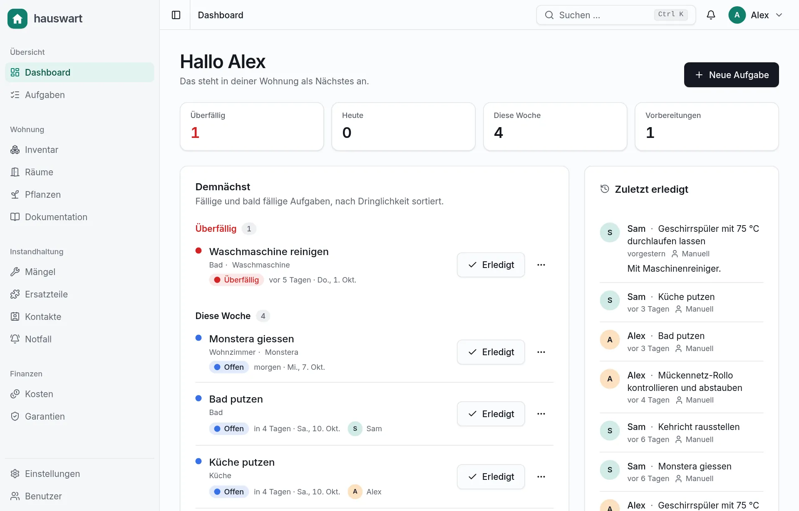

# hauswart

[](https://orellbuehler.github.io/hauswart/)

**Website: <https://orellbuehler.github.io/hauswart/>** (screenshots show synthetic demo data)

Self-hosted apartment management for a household: recurring maintenance tasks with completion
tracking, documentation, a device inventory, defects, spare parts, contacts and costs.
Integrations (Home Assistant, Paperless-ngx, Kept) are optional adapters, never requirements.

**Status: early development (0.2.0).** The core works (tasks, devices, defects, documentation, spare
parts, costs, iCal feeds, guest links, Home Assistant, Paperless-ngx, Kept, REST API, MCP server), but
this is not a stable release: expect breaking changes between versions, keep backups of `/data`, and read
the [changelog](CHANGELOG.md) before every update. The interface is in German (default) and English.

## Run with Docker

The image is `ghcr.io/orellbuehler/hauswart` (`0.2.0`, `0.2` and `latest`; linux/amd64). Pin a
version tag rather than `latest` while the project is in early development.

```bash
docker run -d --name hauswart --restart unless-stopped -p 3000:3000 \
  -v hauswart-data:/data \
  -e HAUSWART_SECRET_KEY="$(openssl rand -base64 32)" \
  -e ORIGIN=http://localhost:3000 \
  -e HAUSWART_COOKIE_SECURE=false \
  ghcr.io/orellbuehler/hauswart:0.2.0
curl http://localhost:3000/api/health   # {"status":"ok"}
```

That form is for trying it out on one machine: the generated key is not stored anywhere else and
`HAUSWART_COOKIE_SECURE=false` is for plain HTTP only. For a real installation use Compose with the
key in a file (below), put a reverse proxy with HTTPS in front, and drop `HAUSWART_COOKIE_SECURE`.

### Docker Compose

```yaml
services:
  hauswart:
    image: ghcr.io/orellbuehler/hauswart:0.2.0
    restart: unless-stopped
    ports:
      - "127.0.0.1:3000:3000"
    volumes:
      - hauswart-data:/data
    environment:
      HAUSWART_SECRET_KEY: ${HAUSWART_SECRET_KEY:?set it in .env}
      ORIGIN: https://hauswart.example.org
      ADDRESS_HEADER: X-Forwarded-For
      XFF_DEPTH: "1"
      # HAUSWART_SETUP_TOKEN: ${HAUSWART_SETUP_TOKEN}
      # HAUSWART_TZ: Europe/Zurich

volumes:
  hauswart-data:
```

```bash
echo "HAUSWART_SECRET_KEY=$(openssl rand -base64 32)" > .env   # keep a copy somewhere safe
docker compose up -d
```

What to know before the first start:

- **`HAUSWART_SECRET_KEY` is required** (32 random bytes, base64). It encrypts stored credentials such as
  the Home Assistant token. Keep it with your backups: without it those credentials are unreadable and
  must be entered again.
- **`ORIGIN` must be the public URL** the browser uses (`https://hauswart.example.org`, or
  `http://localhost:3000` on plain HTTP together with `HAUSWART_COOKIE_SECURE=false`). Signing in and
  every other cookie-authenticated request check the `Origin` header against it and fail with
  `403 csrf_failed` otherwise.
- **Behind a reverse proxy** (Caddy, nginx, Traefik) terminate TLS there and set `ADDRESS_HEADER` and
  `XFF_DEPTH` to the header your proxy sets and the number of proxies you trust, so the login rate limit
  sees the real client address. Without them every client looks like the proxy and they share one limit.
  A complete Caddy setup is `hauswart.example.org { reverse_proxy 127.0.0.1:3000 }` with
  `ADDRESS_HEADER=X-Forwarded-For` and `XFF_DEPTH=1`.
- **Installing as an app** works over HTTPS (or on `localhost`): the browser offers to install hauswart, iOS
  uses "Add to Home Screen". Nothing about your household is stored on the device, only static files; without
  a connection the app shows a notice. The service worker at `/sw.js` is sent with `Cache-Control: no-cache`:
  do not override that in a proxy or CDN, or new versions reach the installed apps late.
- **Data lives in `/data`** (`hauswart.db`, `files/`, `backups/`). The container runs as user and group
  `1001`. A named volume needs nothing; for a bind mount run `chown -R 1001:1001 ./data` first.
- **`HAUSWART_SETUP_TOKEN`** (optional): when set, first-run setup asks for it. Use it if the instance is
  reachable from the network before you have created the first account; anyone who opens `/setup` first
  would otherwise become the administrator. It has no effect once an administrator exists.
- **`HAUSWART_BACKUP_DIR`** defaults to `/data/backups`: a database copy per day (the newest 14 are kept,
  `HAUSWART_BACKUP_KEEP`) and a mirror of the uploaded files in `backups/files`. That is on the same volume,
  so copy it off the machine as well. Setting the variable empty turns the backups off.

### First run

Open the address in a browser. The setup page creates the administrator account (and asks for the setup
token if you set one). Then add rooms and devices under Inventory, create tasks, and create accounts for the
other household members under Users (administrators only). To look around with sample data first, create an API token under
Settings, API tokens (scopes `read`, `write`, `docs:write`) and import the example apartment from a
checkout of this repository:

```bash
bun scripts/seed.ts --file seed/example.de.json --token hw_... --url http://localhost:3000
```

### Updating and restoring

Back up first (stop the container and copy the volume, or take the newest file from `backups/`), then
pull the new tag and recreate the container: `docker compose pull && docker compose up -d`. Database
migrations run automatically at start and cannot be undone, so going back to an older version means
restoring the backup.

To restore, stop the container, replace `hauswart.db` with a `hauswart-backup-<date>.db`, delete
`hauswart.db-wal` and `hauswart.db-shm`, copy the contents of `backups/files/` into `files/` if files
are missing, and start the container again.

### Build the image yourself

```bash
git clone https://github.com/OrellBuehler/hauswart.git && cd hauswart
docker build -t hauswart --build-arg APP_VERSION=dev .
```

## Configuration

| Variable                 | Default                 | Purpose                                                                                       |
| ------------------------ | ----------------------- | --------------------------------------------------------------------------------------------- |
| `HAUSWART_SECRET_KEY`    | none (required in prod) | 32 random bytes, base64. Encrypts stored secrets.                                             |
| `DATABASE_PATH`          | `./data/hauswart.db`    | SQLite database file.                                                                         |
| `HAUSWART_FILES_DIR`     | `./data/files`          | Uploaded documents and photos.                                                                |
| `HAUSWART_BACKUP_DIR`    | `./data/backups`        | Daily database backups plus a mirror of the uploaded files (`files/`). Set empty to turn off. |
| `HAUSWART_BACKUP_KEEP`   | `14`                    | Number of backups to keep.                                                                    |
| `HAUSWART_TZ`            | `Europe/Zurich`         | Household time zone for calendar dates.                                                       |
| `HAUSWART_COOKIE_SECURE` | `true`                  | Set to `false` only when serving over plain HTTP.                                             |
| `HAUSWART_SETUP_TOKEN`   | none                    | If set, first-run setup asks for this value (guards a new install).                           |
| `BODY_SIZE_LIMIT`        | `512K` (image: `30M`)   | Largest request body the server accepts; uploads are up to 25 MiB.                            |
| `ORIGIN`                 | none                    | Public URL; required behind a proxy and on plain HTTP (CSRF check).                           |
| `ADDRESS_HEADER`         | none                    | Header carrying the client address (for example `X-Forwarded-For`).                           |
| `XFF_DEPTH`              | none                    | Number of trusted proxies for `ADDRESS_HEADER`.                                               |

See [.env.example](.env.example).

Set `HAUSWART_SETUP_TOKEN` when the instance is reachable before you have created the first
account: anyone who can open `/setup` first would otherwise become the administrator. The setup
page then asks for the token; it has no effect once an administrator exists.

## Integrations

Home Assistant, Paperless-ngx and Kept are optional: hauswart works without them. Home Assistant is
connected once for the household (administrators only); Paperless-ngx and Kept are connected by every
person with their own account, so everybody sees exactly what their own account may.

### Home Assistant

1. In Home Assistant, create a long-lived access token (your profile, Security). The user should be an
   administrator if you want area names, device suggestions and the import of rooms; readings and push work
   without.
2. In hauswart open Settings, Integrations (as an administrator), enter the address of Home Assistant as
   hauswart reaches it (usually with port 8123) and the token, and save. Optionally set "Address of this
   app" (how phones reach hauswart; push notifications link to it).
3. Rooms: on the Rooms page, "Import from Home Assistant" lists your areas (with their floors) and creates
   a room for each one you choose, or links an existing room of the same name. Importing again changes
   nothing, and renaming an area in Home Assistant does not rename your room. A room can also be linked
   to or unlinked from an area when you edit it.
4. Tasks can then read counters and states, complete themselves when a counter resets or a state
   changes, and take collection dates from Home Assistant calendars (the trigger editor offers an entity
   picker).
5. Push: install the Home Assistant companion app on your phone, then add its notify service (for
   example `mobile_app_example_phone`) under Settings, Notifications. Quiet hours and the stages you
   want are set there too.
6. The "Done" button on a push notification calls hauswart back. Create an API token of kind "Home
   Assistant" with the scope `ha:action` (Settings, API tokens), store `Bearer hw_...` in Home Assistant's
   `secrets.yaml` as `hauswart_bearer`, and add this package (Settings, Notifications shows it with your
   address filled in):

```yaml
# packages/hauswart.yaml
rest_command:
  hauswart_action:
    url: "https://hauswart.example.org/api/v1/ha/action"
    method: post
    headers:
      authorization: !secret hauswart_bearer
      content-type: application/json
    payload: '{"action": "{{ action }}"}'

automation:
  - alias: hauswart done button
    triggers:
      - trigger: event
        event_type: mobile_app_notification_action
    conditions:
      - condition: template
        value_template: "{{ trigger.event.data.action.startswith('HW_DONE_') }}"
    actions:
      - action: rest_command.hauswart_action
        data:
          action: "{{ trigger.event.data.action }}"
```

The tap completes the task for the person the notification was sent to, once; tapping again does
nothing more.

### Paperless-ngx

Every person connects their own Paperless-ngx account, so a document is only ever shown to somebody whose
own account can see it. Create an API token in your Paperless profile, then connect it under Settings,
Integrations: the card tests the connection and picks tags, custom fields, groups and storage paths from
your Paperless. Members can only use a host that is on the allow-list (see below). Or connect through the
REST API with a token that has the `write` scope:

```bash
curl -X PUT https://hauswart.example.org/api/v1/integrations/paperless \
  -H "Authorization: Bearer hw_..." -H "Content-Type: application/json" \
  -d '{"baseUrl": "https://paperless.example.org", "token": "<paperless api token>"}'
curl -X POST https://hauswart.example.org/api/v1/integrations/paperless/test -H "Authorization: Bearer hw_..."
```

Which tags mark documents the household shares, the custom fields that hold "warranty until", and the
tags, storage path and groups for documents pushed from hauswart are set in the connection's `config`
(`sharedTagIds`, `warrantyFieldId`, `uploadTagIds`, ...; see the OpenAPI description). The pickers
`GET /api/v1/integrations/paperless/{tags,correspondents,custom-fields,groups,storage-paths}` list the ids.
Documents are linked to devices, tasks, defects and other entities with `POST /api/v1/document-links`, or
in the web app from the "Archived documents" section of each entry. The **Documents** page (in the sidebar
once you are connected) lists and searches your documents and shows where each one is used. The MCP server
can search, read, link and unlink documents too (`search_documents`, `link_document`, ...).

### Kept

[Kept](https://github.com/OrellBuehler/kept) is the self-hosted finance app. In Kept, create an API token
under Settings, API tokens with the scopes `transactions:read`, `bills:read`, `links:write` and
`categories:read`, then connect it per person under Settings, Integrations (or through the API,
`PUT /api/v1/integrations/kept`, with the address of Kept and the token). Everything is opt-in: nothing
is read from a Kept category until you map it to a cost category (`config.categoryMap`), and open bills
only become tasks (visible to the whole household) with `"billTasks": true`. The card lists the scopes
the token misses (`POST /api/v1/integrations/kept/test`), picks the categories from your Kept, and syncs
on request (`POST /api/v1/finance/sync`); offered transactions and bills wait in a private inbox
(Costs, Inbox in the web interface, a card on the dashboard while something waits, or
`GET /api/v1/finance/suggestions`) until you accept them. Bills shown as tasks link back to the bill in
Kept for the person whose Kept it is. Booked costs are linked back in Kept when the server knows its own
address (`ORIGIN`); the connection test says when it does not. The MCP server can work through the inbox
too (`list_finance_suggestions`, `accept_finance_suggestion`, `dismiss_finance_suggestion`, `sync_finance`).

### Network access

The server fetches the address a person enters, so which hosts a connection may point at is restricted:

- **Allow-list.** Administrators may connect any host. Other members may only save a Paperless or
  Kept connection whose host is on the household's list, kept under Settings, Household
  (`integrationHostAllowlist` in `PATCH /api/v1/household`, visible to administrators only). Entries
  are host names or addresses, optionally with a port (`docs.example.org`, `nas.example.org:8000`),
  compared exactly and case-insensitively (internationalised names as punycode); an entry without a
  port allows every port of that host. The list starts empty, so until an administrator adds hosts
  members cannot connect their own accounts, and saving a connection never adds a host by itself.
- **Never reachable**, for anybody: link-local addresses (169.254.0.0/16, fe80::/10) and cloud
  metadata endpoints (100.100.100.200, `metadata.google.internal`). Host names are resolved and every
  address is checked when a connection is saved and again before every request.
- **Loopback** (127.0.0.0/8, ::1) is reserved for administrators' connections and the household-wide
  Home Assistant connection.

## MCP server

hauswart serves an MCP server itself, so Claude (Claude Code, Claude Desktop, any MCP client) can look
things up and operate hauswart through the REST API with a scoped token. Nothing to install: create a
token of kind "MCP server" under Settings > API tokens, then

```bash
claude mcp add --transport http hauswart https://hauswart.example.org/api/v1/mcp \
  --header "Authorization: Bearer hw_xxxxxxxx"
```

Claude Desktop and the OAuth-only connectors of claude.ai are covered in [mcp/README.md](mcp/README.md),
which also has the scopes and the tool list.

## Development

Requires [Bun](https://bun.sh) 1.4 or newer.

```bash
bun install
bun dev                  # dev server
bun run verify           # format:check + lint + check + test
bun run build && bun run start  # start runs with NODE_ENV=production: HAUSWART_SECRET_KEY is required
bun run db:generate      # after editing src/lib/server/schema.ts
bun run openapi          # regenerate docs/openapi.json (the versioned /api/v1 contract)
bun run leak-guard --all # scan the tree for configured private terms
bun scripts/generate-pwa-icons.ts  # re-render static/icons from the logo
```

Hooks run through [prek](https://github.com/j178/prek): `prek install` once per clone.
See [CLAUDE.md](CLAUDE.md) for architecture and conventions.

## License

[PolyForm Noncommercial 1.0.0](LICENSE) — free for personal and other noncommercial use.
